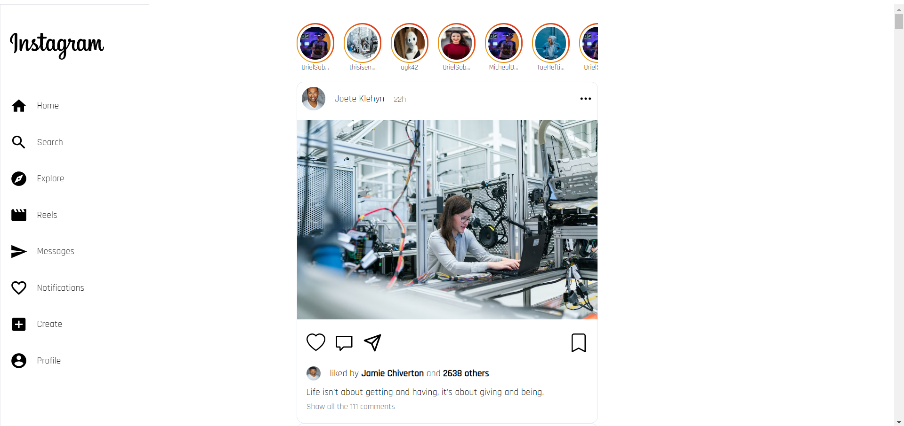
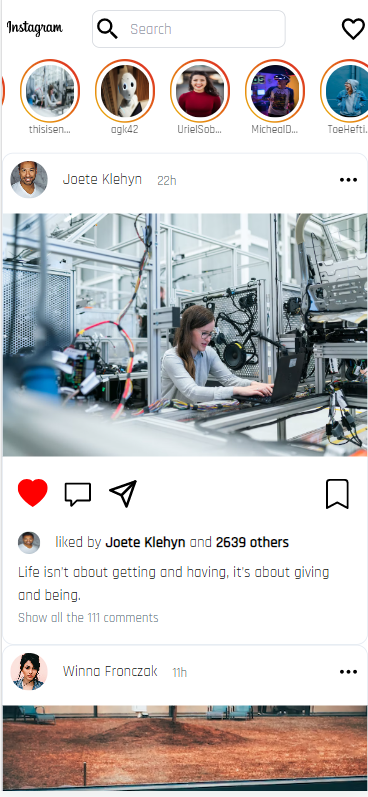
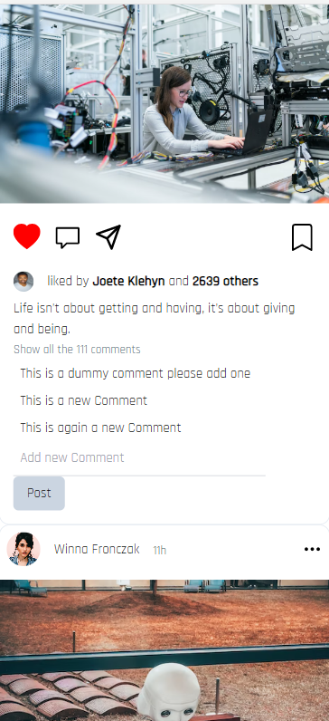

# Instagram clone with React

#### Dependencies Used

 * React.Js
 * TailwindCSS for styling purpose
 * React Icons for Icons

#### Deployment

 * This application is deployed on vercel
 * link to the application :=> https://instagram-delta-sooty.vercel.app/
 
## Features

 * Post Listing
   * Like posts
   * Comment on posts
        * View all comments on a post
 * Share, Save (will only change the color of icons)
 * Search for posts list based on the keyword typed in search matching the content in the description.
 * Responsive design
 * Stories list
 * Opening particular story
 


## Screenshots


## Large Screen


## Mobile Screen


## Comment Post



## Getting started


#### 1. NPM should be installed

#### 2. Clone the repo

```sh
$ git clone https://github.com/Surajmicky/instagram.git
$ cd instagram/
```
#### 3. Download Dependencies
```sh
$ npm install
```

#### 4. Run the application
```sh
$ npm start
```
* Application will start on localhost:3000 
